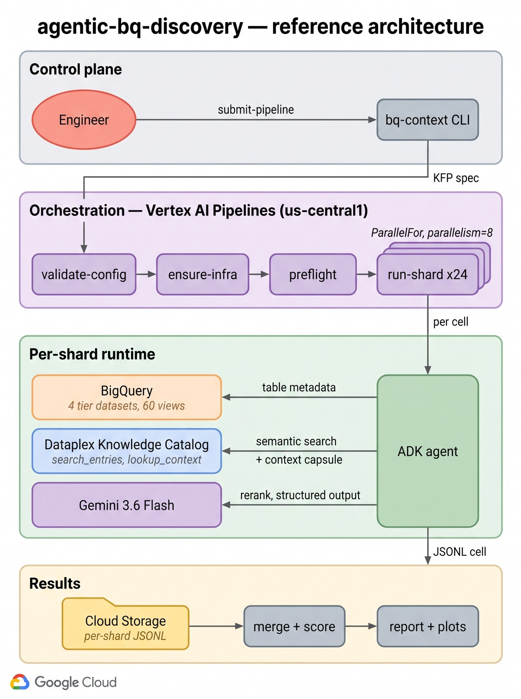
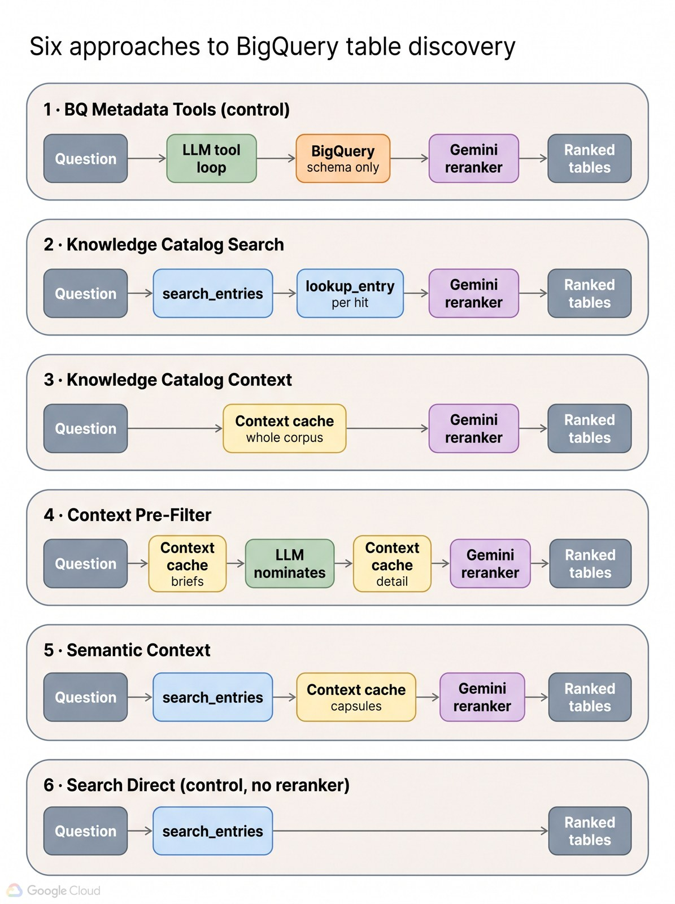
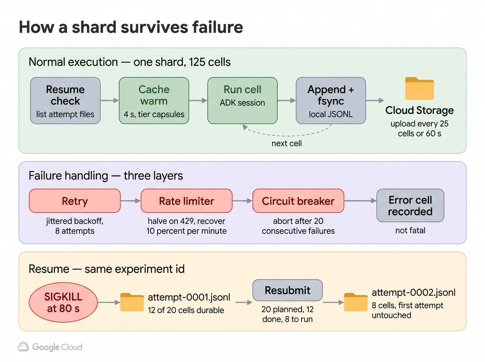

<div align="center">

# 🔍 agentic-bq-discovery 🧭

<p align="center">
  <a href="https://github.com/tottenjordan/agentic-bq-discovery/actions/workflows/ci.yml"></a>
  
  
  
  
  
  
  
  
  
</p>

</div>

> **Which tables should an agent read before it writes SQL?** A factorial benchmark of **six BigQuery table-discovery strategies** across **four levels of catalog enrichment**, built on **[Google ADK](https://google.github.io/adk-docs/) 1.39**, **`gemini-3.6-flash`** + **`gemini-3.5-flash-lite`**, the **[Dataplex Knowledge Catalog](https://cloud.google.com/dataplex/docs/catalog-overview)** (`search_entries`, `lookup_entry`, and the preview [`lookup_context`](https://cloud.google.com/dataplex/docs/retrieve-data-context) capsule API), and **Vertex AI Pipelines** for sharded, resumable execution.

An agent handed the wrong tables writes confidently wrong SQL. This repo measures the retrieval step that runs *before* NL2SQL: it replicates one 15-table corpus across four enrichment tiers (schema → profiling → glossary → guidelines), runs **6 approaches × 4 tiers × 25 questions × 5 runs = 3,000 isolated approach-runs** against live Gemini, and scores each with graded relevance so precision, rank quality, and deliberately-baited trap questions all mean something. It reproduces and extends the experiment published in [`statmike/vertex-ai-mlops`](https://github.com/statmike/vertex-ai-mlops/tree/main/Applied%20ML/AI%20Agents/bigquery-context) (Apache-2.0), rebuilding its ~12-hour serial harness into a sharded, resumable, pipeline-orchestrated one that finishes in ~2 hours.

| Stage | Module | What it does |
| :--- | :--- | :--- |
| 1 | 🏗️ **`bq_context.corpus`** | **Corpus provisioning:** creates 4 tier datasets, 60 views over `bigquery-public-data`, 45 Dataplex profile scans, a business glossary with 11 terms, and 48 term↔column entry links. Idempotent. |
| 2 | 🧠 **`bq_context.approaches`** | **The six discovery agents:** ADK agents emitting one shared `RerankerResponse` contract, so wildly different mechanisms stay directly comparable. |
| 3 | 📦 **`bq_context.context_cache`** | **Knowledge Catalog capsules:** batched `lookup_context` (10 entries/call) split into *brief* and *detailed* views, owned per-tier so two tiers can never bleed into each other. |
| 4 | ⚖️ **`bq_context.reranker`** | **Shared Gemini reranker:** structured output at `temperature=0.0`, with token accounting recorded once per kept response so retries never inflate cost. |
| 5 | 🔁 **`bq_context.runner`** | **Sharded execution:** per-cell JSONL checkpointing, resume after `SIGKILL`, jittered backoff, an adaptive rate limiter, and a circuit breaker. |
| 6 | 📊 **`bq_context.scoring`** | **Graded metrics:** discovery vs final recall, rerank loss, nDCG@5, precision with distractors — a port verified against upstream's published numbers. |
| 7 | 🚀 **`bq_context.pipeline`** | **Vertex AI Pipelines:** `ExitHandler` + `ParallelFor(8)` over 24 shards, each component a thin wrapper over the same CLI. |

<details>
  <summary>how a single question flows through the system</summary>

<br />

1. **Scope** — a `TierContext` pins the run to exactly one tier dataset. All four hold identically-named tables and scoring matches on the short name, so seeing two tiers at once would silently score against the wrong corpus.
2. **Discover** — the approach nominates candidate tables: an LLM tool loop over BigQuery metadata, a semantic `search_entries` call, or the whole cached corpus.
3. **Enrich** — cache-backed approaches attach the Knowledge Catalog capsule: column profiling, glossary definitions, and authored guidance.
4. **Rerank** — five of six pass candidates to a shared Gemini reranker with a structured `RerankerResponse` schema. The sixth deliberately does not, isolating what reranking buys.
5. **Record** — the cell writes `nominated_tables_{method}` and `reranker_result_{method}` to ADK session state. Those two keys are the *entire* integration surface, and splitting them is what makes **discovery recall vs final recall** measurable: did retrieval find the table, and did the reranker keep it?
6. **Checkpoint** — the cell is appended to local JSONL, `fsync`'d, and uploaded within 60 seconds, so no work is ever further than a minute from durable.
7. **Score** — graded relevance (`must_have`=2, `nice_to_have`=1, `distractor`=0) yields recall, nDCG@5, and precision.

</details>

<div align="center">
  
</div>

---

## 🎯 The Challenge

Before an agent can write SQL, it has to find the *right tables* — from tens to
thousands of candidates, many with lookalike names. A taxi *zone-lookup* table
sitting next to the trips table. A *Citi Bike* stations table when the question
is about Austin. Get retrieval wrong and the best SQL model in the world
confidently answers a different question than the one you asked.

So there are really two questions:

1. **Which discovery strategy retrieves the right tables?**
2. **How much does richer catalog metadata — profiling, a business glossary,
   authored NL→SQL guidance — actually help?**

The second is easy to get wrong. If you enrich only some topics, "enrichment
helps" becomes confounded with "those topics were easier." Measuring it honestly
requires a designed experiment, not a before-and-after.

---

## 🧪 The Experiment

**Independent variable:** catalog **enrichment tier** —
`0` schema only → `1` + profiling → `2` + glossary → `3` + guidelines.

**Held constant:** the corpus. `ensure-infra` replicates the **identical**
15-table corpus into one dataset per tier (`bigquery_context_tier0`..`_tier3`).
The datasets differ *only* in catalog enrichment, so every topic appears at every
tier and tier is decoupled from topic. **The replication is the ablation.**

**Design:** a full factorial over four factors — **3,000 isolated approach-runs**.

| Factor | Levels | Notes |
|---|---|---|
| **Approach** | 6 | The discovery strategies compared below |
| **Tier** | 4 | Enrichment level `0`–`3` — the independent variable |
| **Question** | 25 | The graded set, composition below |
| **Run** | 5 | Replicates per cell, for medians and spread |

Each cell is an **isolated** approach-run on its own ADK session, so latency and
token attribution stay clean. The 24 `(tier, approach)` shards run 8-wide on
Vertex AI Pipelines.

### The corpus

15 tables as views over `bigquery-public-data` — **12 answer tables and 3
deliberate distractors** spanning transportation, weather, demographics,
geography, and health. The distractors are chosen to be baited, not merely
irrelevant: `citibike_stations` (NYC, baits Austin questions), `taxi_zone_geom`
(zone polygons, baits fare/tip questions), and `unemployment_cps` (national
monthly, baits local ZIP-level socioeconomic questions).

### The 25 questions

Deliberately weighted toward the hard case — nearly half require joining tables
that share no obvious name, which is where discovery strategies actually
separate.

| Category | Count | What it tests | Example |
|---|---|---|---|
| `single-table` | 5 | Basic discovery, plus rejecting a same-topic distractor | *"What were the strongest hurricanes to make landfall in the last 20 years?"* |
| `multi-table-related` | 4 | Tables an analyst would obviously pair | *"Which bike share stations have the highest average trip duration, and where are they located?"* |
| `multi-table-disparate` | 12 | Seemingly unrelated tables joined via geography (ZIP / county FIPS) — the hard case | *"Which US counties have the most weather stations per capita?"* |
| `trap` | 4 | Phrased to bait a distractor; the `must_have` is the real table | *"Which Citi Bike-style docking stations in Austin are the busiest?"* |

<details>
<summary><b>All 25 questions with their required tables</b></summary>

<br />

All **25** graded questions (5 single-table, 4 multi-table-related, 12 multi-table-disparate, 4 trap). `Must-have` tables are the recall target; `distractor` is the baited wrong table.

| # | Category | Question | Must-have tables | Distractor baited |
|---|---|---|---|---|
| `single-q1` | single-table | What are the busiest bike share stations in Austin by month? | `austin_bikeshare_trips` | `citibike_stations` |
| `single-q2` | single-table | How do tip amounts vary by time of day for NYC taxi rides? | `nyc_taxi_trips_2022` | `taxi_zone_geom` |
| `single-q3` | single-table | What were the strongest hurricanes to make landfall in the last 20 years? | `hurricanes` | — |
| `single-q4` | single-table | Which baby names have grown fastest in popularity across US states since 1990? | `usa_names_1910_current` | — |
| `single-q5` | single-table | What is the average birth weight by US county? | `county_natality` | — |
| `multi-rel-q1` | multi-table-related | Which bike share stations have the highest average trip duration, and where are they located? | `austin_bikeshare_trips`, `austin_bikeshare_stations` | `citibike_stations` |
| `multi-rel-q2` | multi-table-related | Are there weather stations near the paths of major hurricanes? | `hurricanes`, `weather_stations` | — |
| `multi-rel-q3` | multi-table-related | Which US counties have the worst annual air quality, and what are their boundaries? | `air_quality_annual_summary`, `us_counties` | — |
| `multi-rel-q4` | multi-table-related | How do birth rates compare across US counties relative to their population? | `county_natality`, `population_by_zip_2010` | — |
| `multi-disp-q1` | multi-table-disparate | Is there a correlation between crime rates and bike share usage near specific stations in Austin? | `austin_crime`, `austin_bikeshare_trips`, `austin_bikeshare_stations` | `citibike_stations` |
| `multi-disp-q10` | multi-table-disparate | Which US counties have the most weather stations relative to their resident population? | `us_counties`, `weather_stations`, `population_by_zip_2010` | — |
| `multi-disp-q11` | multi-table-disparate | Which US counties have the highest number of births per capita? | `county_natality`, `population_by_zip_2010` | — |
| `multi-disp-q12` | multi-table-disparate | Which US counties have the most births relative to their resident population? | `county_natality`, `population_by_zip_2010` | — |
| `multi-disp-q2` | multi-table-disparate | How does population density by ZIP code relate to bike share station placement in Austin? | `population_by_zip_2010`, `austin_bikeshare_stations` | `citibike_stations` |
| `multi-disp-q3` | multi-table-disparate | Which US counties have the most weather stations per capita? | `us_counties`, `weather_stations`, `population_by_zip_2010` | — |
| `multi-disp-q4` | multi-table-disparate | Does county air quality relate to average birth weight across the US? | `air_quality_annual_summary`, `county_natality` | — |
| `multi-disp-q5` | multi-table-disparate | Do Austin ZIP codes with more reported crime also have worse air quality? | `austin_crime`, `air_quality_annual_summary` | — |
| `multi-disp-q6` | multi-table-disparate | Which Austin ZIP codes have the most reported crimes per capita? | `austin_crime`, `population_by_zip_2010` | `unemployment_cps` |
| `multi-disp-q7` | multi-table-disparate | Which Austin ZIP codes have the most reported crime relative to their resident population? | `austin_crime`, `population_by_zip_2010` | `unemployment_cps` |
| `multi-disp-q8` | multi-table-disparate | Which Austin ZIP codes have the most reported crimes per square mile? | `austin_crime`, `zip_codes` | — |
| `multi-disp-q9` | multi-table-disparate | Which Austin ZIP codes have the most reported crime relative to their land area? | `austin_crime`, `zip_codes` | — |
| `trap-q1` | trap | Which Austin bike share stations currently have the most open docks? | `austin_bikeshare_stations` | `citibike_stations` |
| `trap-q2` | trap | What is the total fare and tip revenue collected across NYC taxi zones? | `nyc_taxi_trips_2022` | — |
| `trap-q3` | trap | How does the unemployment rate differ between high-crime and low-crime Austin ZIP codes? | `austin_crime` | `unemployment_cps` |
| `trap-q4` | trap | Which Citi Bike-style docking stations in Austin are the busiest? | `austin_bikeshare_trips`, `austin_bikeshare_stations` | `citibike_stations` |

</details>

Source: [`experiments/questions.json`](experiments/questions.json) · rubric:
[`experiments/GROUND_TRUTH.md`](experiments/GROUND_TRUTH.md)

### How it stays honest

- **Two enrichment-invariant controls.** `bq_tools` reads BigQuery schema and
  `search_direct` applies no reranker at all, so neither consumes catalog
  enrichment. They bracket what enrichment adds over a schema-only baseline.
- **Graded ground truth.** `must_have` (gain 2) / `nice_to_have` (gain 1) /
  `distractor` (gain 0), so precision and rank quality are meaningful rather
  than decorative.
- **Means where medians lie.** On a corpus this easy most cells score 1.0, so
  the discovery-vs-rerank headline uses means; a median saturates at 100% and
  hides the tail. Both are reported for the tier response.
- **A gate before any measurement.** `preflight` prints what enrichment actually
  reached the capsule at each tier and refuses a run where it did not.

### Known caveats on the enrichment axis

Two things weaken the tier variable in this environment, both measured and
documented rather than assumed:

| Tier | Intended | Actual |
|---|---|---|
| 2 | + business glossary | ✅ 18 annotated columns / 8 tables — but the capsule truncates schemas to **25 columns** by default, so 6 of 24 term links never reach the reranker. `all_schema_fields=true` recovers them at ~1.8× cost |
| 3 | + authored guidelines | ⚠️ Uses the `overview` aspect: `guidelines` is not available in this project, and it is an availability restriction, not an IAM gap |

Detail: [`docs/notes/gcp/lookup-context-capsule.md`](docs/notes/gcp/lookup-context-capsule.md)
and [`docs/notes/gcp/corpus-provisioning.md`](docs/notes/gcp/corpus-provisioning.md).

---

## 🥊 The Six Approaches

All six emit the same `RerankerResponse`, so the comparison is apples-to-apples. Approaches **1** and **6** are controls that bracket the others.

<div align="center">
  
</div>

| # | Approach | Discovery mechanism | ADK hook | Cache | Rerank |
|---|---|---|---|---|---|
| 1 | **BQ Metadata Tools**<br>`agent_bq_tools` | LLM tool loop over `BigQueryToolset` — schema only, no catalog | `after_tool_callback` | ✗ | ✓ |
| 2 | **KC Search**<br>`agent_kc_search` | `search_entries` + per-hit `lookup_entry` | `before_agent_callback` | ✗ | ✓ |
| 3 | **KC Context**<br>`agent_kc_context` | Whole cached corpus, no retrieval step | `before_agent_callback` | ✓ | ✓ |
| 4 | **Context Pre-Filter**<br>`agent_context_prefilter` | LLM nominates from briefs, then rerank on detail | `after_agent_callback` | ✓ | ✓ |
| 5 | **Semantic Context**<br>`agent_semantic_context` | `search_entries` + cached capsules (2 ∪ 3) | `before_agent_callback` | ✓ | ✓ |
| 6 | **Search Direct**<br>`agent_search_direct` | Search relevance order *as* the ranking | `before_agent_callback` | ✗ | ✗ |

**What each one isolates:**

- **1 vs the rest** — is a plain BigQuery metadata loop enough, without any catalog investment?
- **2 vs 6** — byte-identical retrieval, with and without the reranker. The cleanest measure of reranking's marginal value.
- **3 vs 5** — is a retrieval step needed at all, or can you just send the whole corpus?
- **4 vs 3** — does an LLM pre-filter on cheap briefs beat reranking everything on full detail?
- **5 vs 2** — same search, richer metadata: does the capsule beat per-hit `lookup_entry`?

**Measured cost** (upstream's published figures, which our first live runs track within ~15%):

| Approach | p50 latency | Reranker tokens | Trade-off |
|---|---|---|---|
| 1 · BQ Tools | 39.5 s | 3,470 | Cheapest tokens, **20× the latency** — it is the only real tool loop |
| 2 · KC Search | 8.6 s | 8,388 | Balanced |
| 3 · KC Context | 4.0 s | 44,020 | Fastest reranked, **most expensive** — ships the whole corpus |
| 4 · Pre-Filter | 14.6 s | 10,749 | Two LLM calls; best recall of the context approaches |
| 5 · Semantic | 6.1 s | 14,909 | Good balance of both |
| 6 · Search Direct | **2.1 s** | **0** | Free and instant, but **50% precision** vs 100% |

> The headline finding it reproduces: **semantic search alone already retrieves nearly every correct table.** Reranking buys *precision*, not recall — `search_direct` matched the rerankers on recall while trailing badly on nDCG@5 for disparate multi-table and trap questions.

---

## 🔌 Key APIs Used

| API | SDK / Protocol | What it returns | Used by |
|---|---|---|---|
| BQ `list_dataset_ids`, `list_table_ids`, `get_table_info` | ADK [`BigQueryToolset`](https://google.github.io/adk-docs/integrations/bigquery/) | Schema (names, types, modes), description, row count. No column descriptions, no profiling | Approach 1 |
| KC [`search_entries`](https://cloud.google.com/dataplex/docs/search-assets) | `google-cloud-dataplex` | Semantically ranked in-scope entries; count set by search's own relevance cutoff | Approaches 2, 5, 6 |
| KC `lookup_entry` | `google-cloud-dataplex` | Schema + catalog aspects as JSON — no profiling stats | Approach 2 |
| KC [`lookup_context`](https://cloud.google.com/dataplex/docs/retrieve-data-context) | `google-cloud-dataplex` ≥ 2.20.0, **preview** | LLM-ready capsule: schema + descriptions + `dataProfile` + per-column glossary `terms` + aspects. Batch limit **10 entries/call** | Approaches 3, 4, 5 (via cache) |
| `generate_content` | `google-genai` → Vertex AI | Structured `RerankerResponse` JSON, `temperature=0.0` | Approaches 1–5 |
| Dataplex `DataScan` | `google-cloud-dataplex` | Column profiling published to the catalog (tiers 1–3) | `ensure-infra` |
| Dataplex Business Glossary | `google-cloud-dataplex` | 11 terms + 48 term↔column entry links (tiers 2–3) | `ensure-infra` |
| Vertex AI Pipelines | `kfp` + `google-cloud-aiplatform` | Sharded orchestration with retries and caching | `submit-pipeline` |

### Two API behaviours worth knowing before you trust a result

**`lookup_context` returns an empty response rather than `403`** when permissions are missing. An under-permissioned run therefore produces tiers that score identically, a green pipeline, and a plausible *wrong* null result. `bq-context preflight` exists to catch exactly this.

**The capsule truncates each schema to 25 columns by default.** On a 153-column table that silently drops glossary annotations past the cut — weakening the enrichment variable precisely on the wide tables where it would matter most. `all_schema_fields=true` recovers them at ~1.8× capsule size. Of the two options upstream flagged as unverified, that one works and the `context_budget` / `budget` keys do nothing. Full measurements: [`docs/notes/gcp/lookup-context-capsule.md`](docs/notes/gcp/lookup-context-capsule.md).

### Shared context cache

Approaches 3, 4, and 5 read one per-tier cache built from batched `lookup_context`, with two views derived from the same JSON:

| View | Method | Content | Used by |
|---|---|---|---|
| **brief** | `cache.all_briefs()` | Capsule with per-column `dataProfile` stripped — keeps schema, descriptions, and glossary `terms` | Approach 4 (LLM pre-filter prompt) |
| **detailed** | `cache.all_detailed()`, `cache.detailed_for()` | Full capsule including `dataProfile` (nullRatio, distinctValues, sampleValues) | Approaches 3, 4 (rerank), 5 |

The brief is *subtractive* — it strips only the heavy profiling block, so cheap high-signal enrichments survive into pre-filtering without extra API calls. The cache is owned by a `TierContext` rather than a module global, which is what makes 24 shards safe to run in parallel.

---

## ✨ Key Features

- **Six approaches, one comparable contract.** Wildly different mechanisms, one `RerankerResponse`.
- **A verified metrics port.** A golden test scores upstream's real 3,000-cell results and reproduces **all 18 numbers of their published table**.
- **Resumable at two levels.** Per-cell JSONL checkpointing (verified under `SIGKILL`) and per-shard KFP caching — a long sweep never loses more than 60 seconds.
- **Honest gates.** `preflight` refuses to let you measure a catalog that only *looks* enriched.
- **Built for a shared quota pool.** Jittered backoff, adaptive rate limiting, and a circuit breaker, because these models run on Dynamic Shared Quota where a 429 means contention, not a raisable limit.
- **Retry-safe cost accounting.** Tokens are recorded once per kept response, never per attempt.
- **Runs locally or on Vertex AI.** Every pipeline component wraps the same CLI, so a pipeline failure reproduces on a laptop with one command.

<div align="center">
  
</div>

---

## 🚀 Getting Started

### System requirements

| Requirement | Notes |
|---|---|
| Python 3.13 | `uv` provisions it; no system install needed |
| [uv](https://github.com/astral-sh/uv) ≥ 0.11.28 | Required — the build backend is `uv_build` |
| Google Cloud SDK | `gcloud`, authenticated |
| A GCP project | BigQuery, Dataplex, Vertex AI, and Cloud Storage enabled |
| Docker *(optional)* | Only to build the pipeline image locally |

### 1. Install

```bash
git clone https://github.com/tottenjordan/agentic-bq-discovery.git
cd agentic-bq-discovery
make install          # uv sync --all-groups
```

### 2. Authenticate

```bash
gcloud auth application-default login
gcloud config set project YOUR_PROJECT_ID
```

### 3. Configure

```bash
cp .env.example .env
```

Only `GOOGLE_CLOUD_PROJECT` is required. See [`.env.example`](.env.example) for every variable.

| Variable | Default | Purpose |
|---|---|---|
| `GOOGLE_CLOUD_PROJECT` | *(none)* | **Required.** No default, deliberately |
| `BQ_LOCATION` | `US` | Dataset multi-region |
| `DATAPLEX_LOCATION` | `us-central1` | Data scans must be single-region |
| `AGENT_MODEL` | `gemini-3.6-flash` | Agent reasoning model |
| `TOOL_MODEL` | `gemini-3.5-flash-lite` | Reranker model |
| `RESOURCE_PREFIX` | `bigquery_context` | Prefix for the four tier datasets |
| `TOP_K` | `5` | Tables the reranker returns |
| `BQ_CONTEXT_IMAGE` | *(none)* | Pipeline only; from `make image-ref` |

> **Both Gemini models resolve only at the `global` Vertex endpoint** — they return 404 in `us-central1`. The client is configured automatically.

### 4. Verify and provision

```bash
bq-context validate-config     # identity, 16 permissions, models, storage (~30s)
bq-context ensure-infra        # 4 datasets, 60 views, 45 scans, glossary (~20 min)
bq-context preflight --tier 3  # prove enrichment actually reached the capsule
```

`ensure-infra` is idempotent. `preflight` is **not optional** — see [Key APIs Used](#-key-apis-used).

---

## 💻 Usage Examples

### Run one shard locally

```bash
# Smoke test: 3 questions, no LLM at all (~5s)
bq-context run-shard -e smoke --tier 3 --approach search_direct --limit 3 --runs 1
```

```json
{
  "shard_id": "tier3__search_direct",
  "planned": 3, "executed": 3, "succeeded": 3, "failed": 0,
  "elapsed_s": 5.134
}
```

```bash
# A full (tier, approach) shard — 25 questions × 5 runs. Resumable.
bq-context run-shard -e local-01 --tier 3 --approach semantic_context

# Re-running is safe: completed cells skipped, failed cells retried
bq-context run-shard -e local-01 --tier 3 --approach semantic_context
```

Approaches: `bq_tools`, `kc_search`, `kc_context`, `context_prefilter`, `semantic_context`, `search_direct`.

### Score and plot

```bash
bq-context merge -e local-01
bq-context score -e local-01 --report report.md
bq-context plot  -e local-01 --plots-dir plots/
```

```markdown
| Approach                  | Discovery recall | Final recall | Rerank loss |
|---------------------------|------------------|--------------|-------------|
| 1: BQ Tools *(control)*   | 100.0%           | 99.3%        | +0.007      |
| 6: Search Direct *(ctrl)* | 96.7%            | 96.7%        | +0.000      |
```

### Run the whole factorial on Vertex AI

```bash
make image                                       # build, verify, push

bq-context submit-pipeline -e full-01 \
  --profile full --image "$(make -s image-ref)" --skip-infra
```

| Profile | Factorial | Cells | Shards | Wall clock |
|---|---|---|---|---|
| `smoke` | tier 3 × 6 × 3q × 1 | 18 | 6 | ~5 min |
| `pilot` | 4 tiers × 6 × 5q × 1 | 120 | 24 | ~9 min |
| `full` | 4 tiers × 6 × 25q × 5 | 3,000 | 24 | ~2 h |

Resubmit with the **same `experiment_id`** to resume; the GCS prefix derives from it.

### Inspect the enrichment ladder

```bash
bq-context preflight --tier 3
```

```text
tier   tables     bytes  profiled  terms  aspects
0          15    49,089         0      0  —
1          15   118,275       209      0  —
2          15   119,882       209     18  —
3          15   122,346       209     18  overview
```

Full command reference: [`experiments/README.md`](experiments/README.md).

---

## 🗂️ Project Structure

```
src/bq_context/
├── config.py               # Locations + ExperimentConfig, frozen. No globals.
├── runtime.py              # TierContext in a ContextVar — the parallelism unlock
├── usage.py                # Per-cell token accounting, retry-safe
├── schemas.py              # RerankerResponse: the contract all six approaches share
├── discovery_common.py     # Scoped search + rerank helpers shared by 5 approaches
├── cli.py                  # 13 subcommands; every pipeline component wraps one
├── approaches/             # The six discovery agents (35 modules)
│   ├── agent_bq_tools/         # 1 · LLM tool loop over BigQueryToolset
│   ├── agent_kc_search/        # 2 · search_entries + lookup_entry
│   ├── agent_kc_context/       # 3 · whole cached corpus
│   ├── agent_context_prefilter/# 4 · LLM nominates from briefs, then reranks
│   ├── agent_semantic_context/ # 5 · search + cached capsules
│   ├── agent_search_direct/    # 6 · search order as the ranking (no rerank)
│   └── agent_orchestrator/     # parallel fan-out + comparison (interactive use)
├── context_cache/          # Knowledge Catalog capsules, per-tier
│   ├── cache.py                # TableCache: brief + detailed views
│   └── util_lookup_context.py  # Batched lookup_context (10/call), shape normalization
├── reranker/               # Shared Gemini reranker
│   ├── util_rerank.py          # Structured output, temp 0.0, retry-safe accounting
│   └── function_tool_rerank.py # ADK tool wrapper (approach 1)
├── corpus/                 # 4-tier corpus provisioning
│   ├── setup.py                # datasets, views, scans, glossary, entry links
│   └── cleanup.py              # tears down everything setup created
├── runner/                 # Sharded, resumable execution
│   ├── models.py               # Cell, ShardSpec, ShardResult, cell_key
│   ├── shard.py                # The durable cell loop + heartbeat + SIGTERM flush
│   ├── resume.py               # Attempt files, last-write-wins dedupe
│   ├── backoff.py              # Jittered retry, rate limiter, circuit breaker
│   ├── cells.py                # ADK cell executor (InMemoryRunner per approach)
│   └── store.py                # ArtifactStore over GCS or local disk
├── scoring/                # Graded retrieval metrics
│   ├── metrics.py              # recall, nDCG@5, precision, rerank loss
│   ├── report.py               # Markdown report + matplotlib figures
│   └── upstream_build_results.py  # Vendored reference (not imported)
└── pipeline/               # Vertex AI Pipelines
    ├── components.py           # 6 KFP components, each wrapping the CLI
    ├── dag.py                  # ExitHandler + ParallelFor(8)
    ├── compilation.py          # Compile at point of use — never commit YAML
    └── submit.py               # smoke / pilot / full profiles

experiments/                # The experiment definition
├── questions.json              # 25 graded questions, 4 categories
├── GROUND_TRUTH.md             # Corpus, rubric, distractor design
├── upstream_baseline/          # Original published report, for comparison
└── README.md                   # How to run the approaches

tests/                      # 154 tests, hermetic — no GCP credentials needed
├── conftest.py                 # Pins a fake env so tests can't inherit yours
├── test_metrics.py             # Golden test vs upstream's real 3,000 cells
├── test_context.py             # Tier isolation, token accounting under concurrency
├── test_shard.py, test_resume.py   # Checkpointing, dedupe, partial failure
├── test_backoff.py             # Retry, rate limiting, circuit breaker
├── test_pipeline.py            # Compiles the DAG, asserts the compiled spec
├── test_cli.py                 # CLI surface, IAM preflight, enrichment gate
└── fixtures/                   # upstream_results.json.gz (3,000 cells, 125 KB)

docs/
├── notes/                  # Durable findings, one topic per file
│   ├── gcp/                    # Environment, catalog gotchas, IAM, capsule shape
│   └── *.md                    # Container, pipeline, runs, prior art
├── plans/                  # Implementation plans
└── upstream/               # Unmodified upstream reference material

.github/workflows/          # ci.yml (lint/types/tests) · container.yml (image)
Dockerfile · cloudbuild.yaml · Makefile · CODE_STANDARDS.md
```

---

## ✅ Testing

```bash
make test        # pytest
make lint        # ruff format --check, ruff check, ty check src/
make check       # lint, then test
```

```bash
uv run pytest                          # all 154 tests, ~5s, no network
uv run pytest tests/test_metrics.py    # the golden test vs upstream's real data
uv run pytest -k resume                # resume semantics only
```

The suite runs offline — no GCP credentials required. [`tests/conftest.py`](tests/conftest.py) pins a fake environment for every test, so a suite that passes locally cannot quietly depend on your authenticated shell. CI runs with no credentials configured, which keeps that honest.

---

## 🏗️ Tech Stack

| Layer | Technology | Version |
|---|---|---|
| Language | Python | `3.13.14` |
| Packaging | uv (`uv_build` backend) | `0.11.x` |
| Agents | `google-adk` | `1.39.1` |
| Models | `google-genai` → Gemini 3.6 Flash / 3.5 Flash-Lite | `2.24.0` |
| Data | `google-cloud-bigquery` | `3.45.2` |
| Catalog | `google-cloud-dataplex` (Knowledge Catalog) | `2.20.0` |
| Orchestration | `kfp` + `google-cloud-aiplatform` | `2.17.0` / `1.165.1` |
| CLI | `typer` | `0.27.2` |
| Validation | `pydantic` | `2.13.5` |
| Analysis | `numpy`, `matplotlib` | `2.5.3`, `3.11.2` |
| Quality | `pytest`, `ruff`, `ty` | `9.1.1`, `0.16.8`, `0.0.83` |

Storage is Google Cloud Storage (per-shard JSONL). There is no database.

---

## 🤝 Contributing & License

1. Fork and branch from `main`.
2. Read [`CODE_STANDARDS.md`](CODE_STANDARDS.md) — `uv` only, `ruff`, `pytest`, `ty`, and **no tool-attribution lines** in commits or PRs.
3. Make `make check` pass. CI enforces it.
4. Open a PR describing what changed and why.

Durable findings belong in [`docs/notes/`](docs/notes/) — one topic per file, indexed by [`docs/notes/README.md`](docs/notes/README.md).

Licensed under the **Apache License 2.0** — see [`LICENSE`](LICENSE). Vendored upstream components are attributed in [`NOTICE`](NOTICE).
